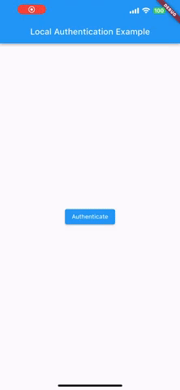

# boraxpr_biometric_example

This Flutter project showcases the implementation of biometric authentication using local_auth.

<div align="center">
  
</div>

### Permission for biometric: If permission is not granted, app will be failed to initialize.
1. IOS at `project/ios/Runner/Info.plist` directly under "dict" tag.
   
```
<key>NSFaceIDUsageDescription</key>
<string>Why is my app authenticating using face id?</string>
```

2. Android at `project/android/app/src/main/AndroidManifest.xml` directly under "manifest" tag.

```<uses-permission android:name="android.permission.USE_BIOMETRIC"/>```

### Android Specific 

At `project/android/app/src/main/kotlin/com/example/{ProjectName}/MainActivity.kt` change the default Activity to use FlutterFragmentActivity.
```
import io.flutter.embedding.android.FlutterFragmentActivity

class MainActivity: FlutterFragmentActivity() {
    // ...
}
```

### iOS Specific

Xcode build will requires you to select your team. To do this, you need to be on MacOS. Then open `project/ios/Runner.xcworkspace` by using Xcode then edit the build setting.

### Add the local_auth dependency

```
dependencies:
  flutter:
    sdk: flutter
  local_auth:
```

### Run
`flutter pub get`

`flutter run`
